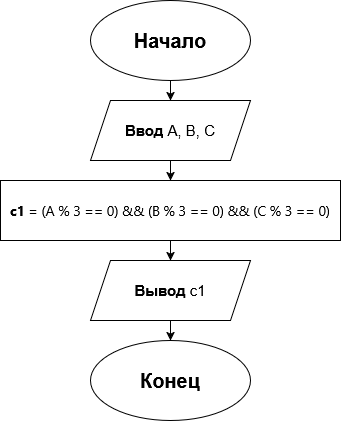

# Домашнее задание к работе 4

## Условие задачи
Три важнейших параметра станка (A, B, C) должны быть идеально отлажены. Система калибровки выдает сообщение об успехе, если каждое из значений параметра кратно трем. Записать условие успешной калибровки. (Вариант 14)

## 1. Алгоритм и блок-схема

### Алгоритм
1. **Начало**
2. Ввести три целых числа — параметры станка **A**, **B** и **C**.
3. Проверить кратность каждого параметра трем: параметр кратен трем, если остаток от деления на 3 равен нулю, то есть **A % 3 == 0**.
4. Записать условие успешной калибровки как логическое И трех проверок:
   - **c1 = (A % 3 == 0) && (B % 3 == 0) && (C % 3 == 0)**
5. Вывести значение условия: **1** — калибровка успешна, **0** — нет.
6. **Конец**

### Блок-схема


## 2. Реализация программы

```c
#define _CRT_SECURE_NO_DEPRECATE

#include <stdio.h>
#include <stdlib.h>

int main() {
    int a, b, c;
    int c1;

    system("chcp 65001 > nul");

    printf("=== СИСТЕМА КАЛИБРОВКИ СТАНКА ===\n");
    printf("Введите три целых числа (параметры A, B, C): ");
    scanf("%d %d %d", &a, &b, &c);

    c1 = (a % 3 == 0) && (b % 3 == 0) && (c % 3 == 0);

    printf("Калибровка успешна (1 - да, 0 - нет): %d\n", c1);

    return 0;
}
```

## 3. Результаты работы программы

Запуск с параметрами **A = 3, B = 6, C = 9** (каждый кратен трем):

```
=== СИСТЕМА КАЛИБРОВКИ СТАНКА ===
Введите три целых числа (параметры A, B, C): 3 6 9
Калибровка успешна (1 - да, 0 - нет): 1
```

Запуск с параметрами **A = 3, B = 6, C = 7** (параметр C не кратен трем):

```
=== СИСТЕМА КАЛИБРОВКИ СТАНКА ===
Введите три целых числа (параметры A, B, C): 3 6 7
Калибровка успешна (1 - да, 0 - нет): 0
```

## 4. Информация о разработчике
Сбоев Даниил, бОТИ-261
